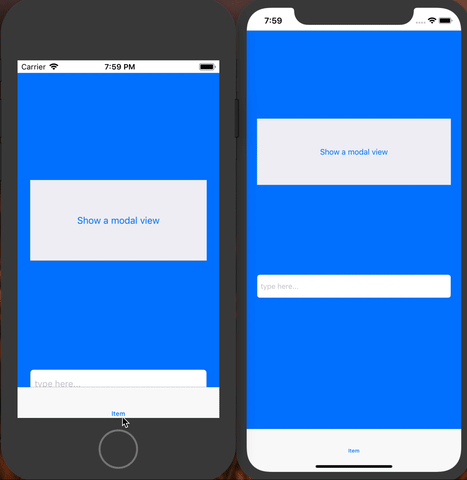
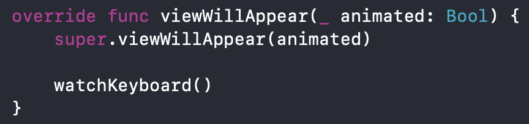

# Keyboard Status Handler
A simple extension to handle height of a scrollView when keyboard is going up or down.

Get ride of a bunch of codes easily buy putting this simple helper in your app.
It's most simple way to handle a scrollView height when keyboard appears. 
No need to connect the scrollView bottom constraint to your class anymore.
Handles old & new iOS Devices with or without notch.

# Usage

1- Just copy 'KeyboardStatusHandler.swift' file to your project.

2- place your controller objects inside an ScrollView.

3- call 'watchKeyboard()' function inside 'viewWillAppear' method.

notice: if you want to dealocate you class later on, call 'stopWatchingKeyboard()' methid inside your 'viewWillDisappear' method.
